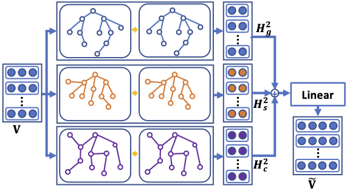

# KAMG

Code repository for EMNLP 2020 proceedings paper [Multi-label Few/Zero-shot Learning with Knowledge Aggregated from Multiple Label Graphs](https://www.aclweb.org/anthology/2020.emnlp-main.235/).




## Introduction 

We intorduce the knowledge aggregation mechanism to improve the few/zero-shot learning performance on MIMIC-II/III datasets as well as the EU legislation dataset.
We extend [Rios & Kavuluru's (2018)](https://www.aclweb.org/anthology/D18-1352/) work with the implementation from Neural classifier ([Liu et al., 2019](https://github.com/Tencent/NeuralNLP-NeuralClassifier)).

To use our codes, please make sure that you have read the README file from [Neural classifier](https://github.com/Tencent/NeuralNLP-NeuralClassifier).

## Support text encoders

* ZSJLCNN - [ACNN + KAMG in our paper](https://www.aclweb.org/anthology/2020.emnlp-main.235/)
* ZAGCNN - [Rios & Kavuluru's (2018) model](https://www.aclweb.org/anthology/D18-1352/)

Other encoders for conventional text classification task are mentioned in [Neural classifier](https://github.com/Tencent/NeuralNLP-NeuralClassifier).

## Dataset

Due to the policy of accessing the MIMIC dataset, you need to follow the instruction on the [web page](https://mimic.physionet.org/gettingstarted/access/) to apply for all datasets.
Tokenization and other data cleaning codes will be provided very soon.

EU legislation dataset could be download from [Chalkidis et al. (2019)](https://github.com/iliaschalkidis/lmtc-eurlex57k)
but the codes for running the experiments of EU legislation dataset are developed based on their original codes, so not included here.

Graph data could be downloaded via the link https://drive.google.com/drive/folders/1tEPUkrZODCCexVwAi29FLkrELGFRkHfp?usp=sharing

Put the data folder under NeuralNLP-NeuralClassifier-KAMG/

Download the pretrained word vector file [Zhang et al. (2019), Chen et al. (2019)](https://github.com/ncbi-nlp/BioSentVec) <br /> 
i.e., wget https://ftp.ncbi.nlm.nih.gov/pub/lu/Suppl/BioSentVec/BioWordVec_PubMed_MIMICIII_d200.vec.bin <br />
After converting into txt file then put it into the dir<br />
```
    NeuralNLP-NeuralClassifier-KAMG/data/biowv.200d.txt
```
The python scripts for generating graph data has been included in the source codes. You may adjust some hyper-parameter for generating your own one.

train-dev-test split follows [Mullenbach et al. (2018)](https://github.com/jamesmullenbach/caml-mimic), text further processed by the script provided in NeuralNLP-NeuralClassifier-KAMG/dataset/data_preprocessor.py,
then convert the data into NeuralClassifier required format.


## Config files

For quickly repeat our experiments results, the config files will also be available in the future.

To simply run the codes, you should 

```
cd NeuralNLP-NeuralClassifier-KAMG
python train.py conf/m3_ZSJLCNN_hsc_avg.json
```

which is same as [Neural classifier](https://github.com/Tencent/NeuralNLP-NeuralClassifier).

## Acknowledgement

Our codes are based on [Neural classifier](https://github.com/Tencent/NeuralNLP-NeuralClassifier), and
we have modified following files which will be different from the source.

* model/rnn.py                           (update)
* model/fusion.py                        (add)
* model/graph_convolution.py             (add)
* model/zlwacnn.py                       (add)
* model/zlwarnn.py                       (add)
* model/zsjlcnn.py                       (add)
* model/zsjlrnn.py                       (add)

* evaluate/classification_evaluate.py    (update)
* dataset/collator                       (update)
* dataset/dataset.py                     (update)
* dataset/classification_dataset.py      (update)
* dataset/generate_graph_data.py         (add)
* dataset/graph_dataset.py               (add)
* util.py                                (add)

## Citation
```
@inproceedings{lu-etal-2020-multi,
    title = "Multi-label Few/Zero-shot Learning with Knowledge Aggregated from Multiple Label Graphs",
    author = "Lu, Jueqing  and
      Du, Lan  and
      Liu, Ming  and
      Dipnall, Joanna",
    booktitle = "Proceedings of the 2020 Conference on Empirical Methods in Natural Language Processing (EMNLP)",
    month = nov,
    year = "2020",
    address = "Online",
    publisher = "Association for Computational Linguistics",
    url = "https://www.aclweb.org/anthology/2020.emnlp-main.235",
    doi = "10.18653/v1/2020.emnlp-main.235",
    pages = "2935--2943",
    abstract = "Few/Zero-shot learning is a big challenge of many classifications tasks, where a classifier is required to recognise instances of classes that have very few or even no training samples. It becomes more difficult in multi-label classification, where each instance is labelled with more than one class. In this paper, we present a simple multi-graph aggregation model that fuses knowledge from multiple label graphs encoding different semantic label relationships in order to study how the aggregated knowledge can benefit multi-label zero/few-shot document classification. The model utilises three kinds of semantic information, i.e., the pre-trained word embeddings, label description, and pre-defined label relations. Experimental results derived on two large clinical datasets (i.e., MIMIC-II and MIMIC-III ) and the EU legislation dataset show that methods equipped with the multi-graph knowledge aggregation achieve significant performance improvement across almost all the measures on few/zero-shot labels.",
}
```
